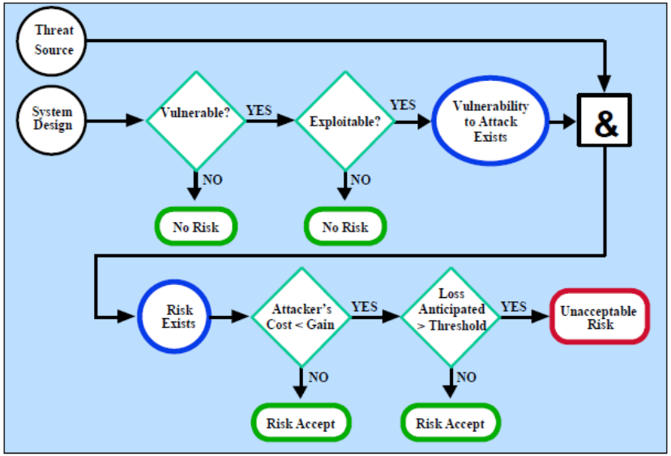

# Aula 3 - Tratamento de Riscos

## Tratamento dos Riscos

Temos várias formas de tratar os riscos, nomeadamente:

- Pela ISO 27005:
  1. **Assumir o risco**: aceitar o risco, devendo ir implementando medidas de mitigação;
  2. **Evitar o risco**: eliminar a ameaça ou a vulnerabilidade;
  3. **Transferir o risco**: transferir o risco para outra entidade (ex: seguros);
  4. **Mitigar o risco**: reduzir a probabilidade ou o impacto do risco;
- Pela ISO 31000:
  1. **Evitar o risco** ao decidir não iniciar ou continuar com a atividade que dá origem ao risco;
  2. **Aceitar/aumentar o risco**, para perseguir uma oportunidade (ex: detetar o atacante);
  3. **Remover a fonte de risco**;
  4. **Mudar a probabilidade**;
  5. **Mudar as consequências**;
  6. **Compartilhar o risco** com outra parte (ex: seguros);
- Pela NIST:
  1. **Assumir o risco**;
  2. **Evitar o risco**;
  3. **Transferir o risco**;
  4. **Planear o risco**;
  5. **Limitar o risco**;
  6. **Reconhecer e desenvolver planos de contingência**.

**Nota**: Na proposta do **NIST**, a **limitação do risco** e o **reconhecimento e desenvolvimento de planos de contingência** são, predominantemente, medidas de **mitigação técnicas**, enquanto as **restantes** são medidas de **mitigação administrativas**.

### *Risk Mitigation Checklist* (NIST)

Toda a proposta de mitigação deve ser examinada através das seguintes premissas:
- **Eficácia**: a proposta é eficaz na redução do risco?
- **Custo/Benefício**: os benefícios superam os custos?
- **Praticabilidade**: a proposta é prática e pode ser implementada?
- **Desafios**: a proposta cria novos riscos ou desafios?
- **Aceitação pelos *stakeholders***: quanta resistência é esperada por parte dos *stakeholders*?
- **Aplicabilidade**: a proposta é aplicável a todos os sistemas e componentes?
- **Durabilidade**: a proposta é durável e sustentável?
- **Riscos residuais**: após a implementação, quais são os riscos que permanecem após a implementação da proposta?
- **Novos riscos**: a proposta cria novos riscos?

### Fluxo de aceitação de riscos

  

### Implementação de controlos

Esta implementação segue os seguintes passos:
1. **Priorizar ações**: o resultado deste passo será as ações avaliadas de alto a baixo risco;
2. **Avaliar opções de controlo**: o resultado deste passo vem de uma lista com os controlos viáveis;
3. **Análise de custo/benefício**: o resultado deste passo será uma lista com os controlos viáveis, ordenados por custo/benefício;
4. **Seleção de controlo**: o resultado deste passo vem da seleção dos controlos a implementar;
5. **Atribuir responsabilidades**: o resultado deste passo será a atribuição de responsabilidades para a implementação dos controlos;
6. **Desenvolver um plano de salvaguarda**: o resultado deste passo será um plano de salvaguarda para a implementação dos controlos;
7. **Implementar controlos**: o resultado deste passo vem da implementação dos controlos;

## Controlo de segurança

A implementação de controlos, deve:
- Resultar de uma avaliação de risco;
- Ter opção de tratamento técnico e administrativo;
- Ter uma análise de custo/benefício;

### Controlos técnicos

Podem ser de:
- **Suporte**: São a base e estão ligados a outros controlos. Permite:
  - identificação de utilizadores, processos e recursos;
  - proporciona uma gestão de chaves utilizadas por outros controlos;
  - configuração apropriada de sistemas;
- **Preventivos**: controlos que previnem a ocorrência de um evento. Permite:
  - assegurar o processo de autenticação e autorização;
  - conseguir a integridade e confidencialidade da informação;
  - garantir o não-repúdio;
  - proteger as comunicações e garantir da privacidade das transações; 
- **Deteção e recuperação**: controlos que detetam e recuperam de um evento. Permite:
  - a deteção de intrusões e contaminantes;
  - recuperação para um estado seguro;
  - a capacidade de auditoria e monitorização;
  - a deteção e erradicação de malware;

  

### Controlos não-técnicos

São implementados em conjunto com os controlos técnicos. Os controlos não-técnicos são **mais focados** na parte **física e logistica** do controlo de segurança.

Podem ser de:
- **Gestão e Organizacionais**: focados na definição de políticas e normas de proteção de informação. Podem ser:
  - **Preventivos**: estabelecendo planos e atribuindo responsabilidades;
  - **Deteção**: através de auditorias periódicas e condução do processo de gestão de risco e revisões e atualizações dos controlos;
  - **Recuperação**: criando a capacidade de resposta a incidentes;
- **Operacionais**: focados em assegurar procedimentos  seguros de governação do IT. Podem ser:
  - **Preventivos**: mantendo em segurança os sistemas de informação, rede e cablagem, proteger os sistemas contra o catástrofes naturais e assegurar o funcionamento de geradores e UPSs;
  - **Deteção**: providenciando segurança física (ex: alarmes) e e assegurar a segurança ambiental (ex: deteção de incêndios);

### Exercício – Identificar controlos de segurança

Controlos não técnicos:
- **Gestão e Organizacionais**:
  - **Preventivos**: Separação de funções, Políticas de segurança;
  - **Deteção**: Auditorias, deteção de intrusões;
  - **Recuperação**: Plano de recuperação de desastres, Planos de continuidade de negócio;
- **Operacionais**:
  - **Preventivos**: Plano de backup
  - **Deteção**: Verificação de integridade de backups;

Controlos técnicos (Por fazer)...

## Modelo de segurança integrado

### ISO 27002

É uma norma que fornece diretrizes para a seleção, implementação e gestão de controlos de segurança da informação, tendo em conta a política de segurança da informação e os objetivos de segurança da informação.

#### Política de segurança

A política de segurança é um documento que define a estrutura de segurança da informação e os objetivos de segurança da informação.

Poderão conter:
- Requisitos para o plano de contingência da organização;
- As necessidades de *backup*;
- A forma de seleção e gestão de ferramentas de *anti-malware*;
- Modo de comunicação de incidentes de segurança;
- A descrição de ações disciplinares para violações de segurança.

Devem ser estruturadas de modo a que exista:
- **Política de topo**: define o comprometimento da gestão de topo. Deverá ser acessível a todos os colaboradores;

  

#### Organização da segurança

A organização da segurança estabelece um modelo de referência de gestão para iniciar e controlar a implementação e operação da segurança da informação dentro da organização.

#### Segurança na gestão de Recursos Humanos

A verificação é feita **antes**, **durante** e **após** a **contratação** de colaboradores. 

É feito:
- Verificação de credenciais;
- Acordo de confidencialidade;
- Responsabilidades e deveres;
- Formação e consciencialização;
- Gestão de recursos.

#### Gestão de ativos

A gestão de ativos é um processo que ajuda a organização a entender o valor dos seus ativos e a controlar os riscos associados a estes ativos.

A informação é classificada, através de:
- Regras de classificação;
- Etiquetagem;
- Manuseamento;

#### Controlo de acessos à informação

Permite definer quem acessa o quê, quando e como.

#### Criptografia

Permite assegurar a utilização adequada e eficaz de criptografia para proteger a confidencialidade, autenticidade e/ou integridade da informação.

##### Exercício – Exemplos de controlos criptográficos

- Com vista à confidencialidade?
  - Cifragem de dados usado algoritmos de cifra;
  - Protocolos de troca de chaves (ex: Diffie-Hellman);
  - HTTPS e SSL/TLS;
  - Cifragem do disco usando *bitlocker*;
- Com vista à integridade?
  - Verificação de ficheiros usando *hash*; 
  - Verificação de ficheiros usando algoritmos de cifra e funções *digest* (ex: HMAC);
- Disponibilidade?
  - Implementação de *backup* de dados de dificil acesso (impedindo ataques ransomware); 
- Outras?

(PÁGINA 52)